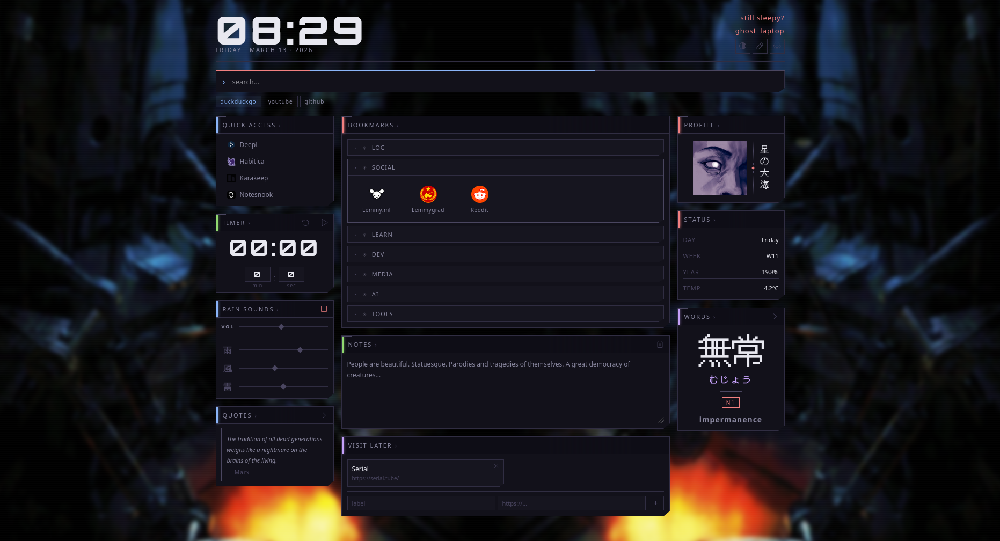

  
  <h1>無タブ · mutabu</h1>

Minimal, customisable Firefox new tab page. Dark/light themes, bookmarks, ambient rain sounds, Japanese word of the day, clock, notes, and more. Licensed under AGPL-3.0.

## Installation

### From Mozilla Add-ons (recommended)

1. Click "Get the Add-On"
2. Confirm permissions

### Manual install (signed)
1. Download `mutabu-1.0.2.xpi` from the [latest release](https://github.com/gary-host-laptop/mutabu/releases/latest)
2. Open Firefox and go to `about:addons`
3. Click the gear icon ⚙ → **Install Add-on From File**
4. Select the downloaded `.xpi` file
5. Click **Add** when prompted
